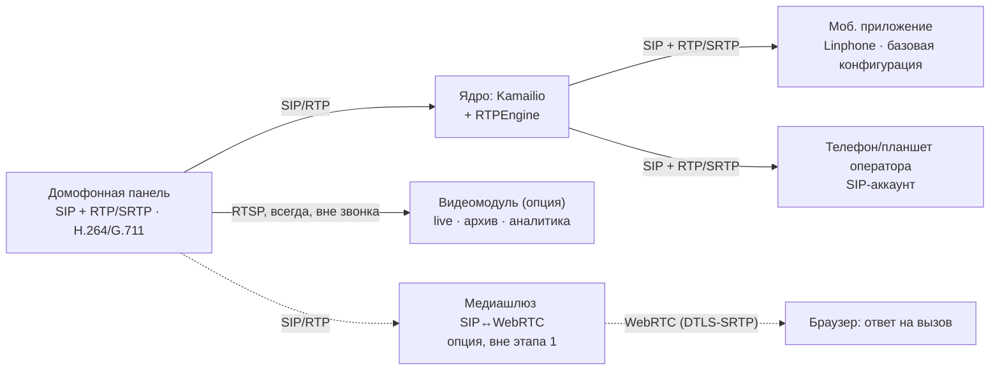

> **Статус:** Черновик (baseline к фиксации) · **Дата:** 2026-07-30
>
> Концепция и техническое задание на проектирование интегрированной цифровой платформы управления многоквартирным домом.
>
> **Базовая платформа — собственное облачное решение** (авторизация и права, `sipmanager`, SIP-сервер Kamailio + RTPEngine, push-шлюз, cloud UI). Видеоплатформа, в том числе Интеллект X, подключается как **опциональный модуль** — это одна из платформ, умеющих видео и детекторы, а не ядро системы.
>
> Фактическое состояние компонентов, на которое опирается документ: [[04 - Состояние интеграции облака и sipmanager]], [[06 - Устройство SIPManager]], [[03 - Состояние Kamailio]], [[01 - Состояние iOS прототипа]], [[02 - Состояние Android прототипа]], [[05 - Разбор непонятных моментов в документах]].

---

## Позиционирование и глоссарий

Документ описывает **интегрированную цифровую платформу управления многоквартирным домом (МКД)**. Важно: это **шире, чем классический BMS** — система объединяет пять разных классов подсистем, где инженерия (BMS/SCADA) — лишь одна из частей, а объединяющий слой ближе к **PSIM** (интеграция систем безопасности).

| Класс подсистемы | Термин | Роль в проекте |
|---|---|---|
| Облачная платформа: SIP identity, провижининг, права, push, UI | **Cloud core** (SIP-сервер внутри контура) | **Ядро** (§2.1) |
| Домофония и связь | **SIP / Intercom** | §3.1 домофония — базовая функция ядра |
| Видеонаблюдение + видеоаналитика | **VMS** | **Опциональный модуль** (§2.6) |
| Инженерия здания (HVAC, лифты, энергоучёт, насосы) | **BMS / BAS**, **SCADA** | Опциональный модуль §3.3 |
| Контроль доступа + пожарная сигнализация | **ACS + Fire**, интеграция уровня **PSIM** | Опциональные модули §3.1 СКУД, §3.2 ОПС |
| Паркинг и въездные группы | **LPR + ACS** | Опциональный модуль §3.4 |

**Расшифровка терминов:**
- **Cloud core (облачное ядро)** — собственное облачное решение: multi-tenant backend (авторизация, права, интеграторы), микросервис `sipmanager` (дерево адресов, панели, аккаунты, share, push), SIP-сервер (Kamailio + RTPEngine), Postgres, cloud UI. Именно оно является базовой платформой продукта.
- **BMS** (Building Management System) / **BAS** (Building Automation System) — управление инженерными системами здания.
- **SCADA** — сбор данных и диспетчерское управление оборудованием в реальном времени.
- **VMS** (Video Management System) — подключаемая платформа видеонаблюдения. Базовый уровень интеграции — любая VMS, принимающая **RTSP**; расширенный уровень (аналитика, ACFA, LPR) — линейка **Интеллект X / Axxon One / Next** (ITV | AxxonSoft). Подробнее — §2.6.
- **ACS** (Access Control System) — СКУД, контроль и управление доступом.
- **LPR** (License Plate Recognition) — распознавание автономеров (для паркинга; на базе модуля Авто-Интеллект).
- **PSIM** (Physical Security Information Management) — надстройка, объединяющая разрозненные системы безопасности в единый интерфейс со сценариями реагирования.
- **SIP / WebRTC / RTP** — стек связи и медиапотока (см. §2.5).

> Итог по позиционированию: называть систему просто «BMS» — занижать охват, а называть её «надстройкой над VMS» — неверно по существу. Корректная формулировка — **«облачная платформа управления МКД: SIP-домофония как базовая функция + подключаемые модули VMS, СКУД/ОПС, SCADA и паркинга»** с объединяющим слоем уровня PSIM.

**Две конфигурации поставки.** Разметка сквозная: пометка **[Р]** по всему документу означает требование расширенной конфигурации.

| Конфигурация | Состав | Что даёт |
|---|---|---|
| **Базовая** | Облачное ядро + панели + мобильное приложение жильца/консьержа | SIP-домофония с видеовызовом, открытие двери (в звонке DTMF и вне звонка HTTP), журнал звонков и доступа, гостевые коды. **Лицензии VMS не требуются** |
| **Расширенная** | Базовая + подключённая видеоплатформа и/или модули инженерии | Live/архив/аналитика по камерам панелей и дома, привязка события к видеофрагменту, ACFA (СКУД/ОПС), LPR-паркинг, SCADA |

---

## 1. Видение системы

Создаётся **облачная цифровая экосистема управления многоквартирным домом (МКД)**. Ядро продукта — облако с встроенным SIP-сервером, закрывающее домофонию «из коробки». Поверх него в одном web-интерфейсе подключаются модули:
- SIP-домофония с видеовызовом на смартфон — **базовая функция ядра**,
- видеонаблюдение и видеоаналитика — **опция**,
- контроль и управление доступом (СКУД) — опция,
- контроль въезда на паркинг (шлагбаумы, распознавание автономеров) — опция,
- пожарная сигнализация (ОПС) — опция,
- мониторинг инженерных систем (SCADA/диспетчеризация) — опция.

**Ключевые принципы:**
- **Облако как ядро** — базовая платформа это наше развёрнутое облачное решение: авторизация и права, дерево адресов/панелей/аккаунтов, провижининг SIP, push-шлюз, web-UI. **SIP-сервер входит в облачный контур**, а не пристраивается к чужому ядру.
- **Видеоплатформа — опция, а не фундамент.** Интеллект X (ITV | AxxonSoft) — одна из платформ, умеющих видео и детекторы; она подключается к ядру, когда заказчику нужны live/архив/аналитика. Базовая конфигурация работает без неё.
- **Работоспособность дома не зависит от каналов наружу** — при недоступности WAN домофонный вызов внутри дома должен проходить через локальный резервный контур (§7.2).
- **Открытые стандарты** — домофония на **SIP (RFC 3261)**, медиа на **RTP/SRTP** (браузер — через WebRTC-шлюз, см. §2.5), видео с панелей на **RTSP**, инженерия на **Modbus/BACnet/OPC UA/MQTT**.
- **Плагинность** — новые типы устройств добавляются модулями к облачному ядру, без изменения ядра и без зависимости от плагинного SDK видеоплатформы.
- **Vendor-agnostic** — не привязываемся ни к железу одного производителя, ни к одной VMS.
- **Web-first** — доступ из браузера без установки ПО; мобильное приложение — для жильцов и консьержа/оператора.

**Целевые заказчики:** застройщик (сдача «умного» МКД), управляющая компания (УК), ТСЖ. Модель поставки — см. §9.

---

## 2. Архитектура системы

Ядро — облачная платформа с встроенным SIP-сервером. Всё остальное (видео, инженерия, ОПС/СКУД, паркинг) — подключаемые модули.

```text
┌───────────────────────────── СЛОЙ ПРЕДСТАВЛЕНИЯ ─────────────────────────────┐
│  Web-клиент (HTML5/JS, REST + события)   │  Моб. приложение жильца/оператора  │
└───────────────┬─────────────────────────────────────────┬────────────────────┘
                │ REST (есть) / события WS-SSE (к разраб.) │ SIP + RTP, push
┌───────────────▼─────────────────────────────────────────▼────────────────────┐
│              ЯДРО — ОБЛАЧНАЯ ПЛАТФОРМА  (базовая конфигурация)               │
│  backend      авторизация, права (canViewSip / canManageSip), интеграторы    │
│  sipmanager   дерево адресов, панели, SIP-аккаунты, share, webhook /calls    │
│  SIP-сервер   Kamailio (proxy / registrar) + RTPEngine (медиа-релей)         │
│  push-шлюз    APNS / FCM                          хранение: Postgres         │
└───┬──────────────────────────────────┬───────────────────────────────────────┘
    │ SIP/RTP · HTTP unlock            │ REST / события  (подключаемые модули)
    ▼                                  ▼
┌──────────────────────┐  ┌────────────┬────────────┬────────────┬────────────┐
│ Вызывные панели      │  │ ВИДЕО      │ SCADA      │ ОПС / СКУД │ Паркинг    │
│ capability camera    │  │ (опция)    │ (опция)    │ (опция)    │ (опция)    │
│   → RTSP             │  │ любая VMS  │ Modbus /   │ ACFA или   │ LPR +      │
│ capability unlock    │  │ по RTSP;   │ BACnet /   │ свои       │ шлагбаумы  │
│   → HTTP/CGI, DTMF   │  │ расшир. —  │ OPC UA /   │ драйверы   │            │
│ SIP UA → Kamailio    │  │ Интеллект X│ MQTT       │            │            │
└──────────────────────┘  └────────────┴────────────┴────────────┴────────────┘
        RTSP панелей идёт в видеомодуль напрямую, постоянно, вне SIP и вне звонка

┌───────────────────── опционально, вне этапа 1 (см. §2.5) ────────────────────┐
│  SIP↔WebRTC шлюз (Janus / FreeSWITCH / RTPEngine в WebRTC-профиле) + coturn  │
│  требуется только для ответа на вызов из браузера                            │
└──────────────────────────────────────────────────────────────────────────────┘
```

### 2.1. Ядро — облачная платформа (реализовано, работает на стенде)

Ядро — **наше облачное решение**, а не платформа видеонаблюдения. Состав и статус:

| Компонент | Ответственность | Статус |
|---|---|---|
| **backend** (`axxoncloudgo`) | Авторизация JWT, права `canViewSip` / `canManageSip`, пользователи, интеграторы, multi-tenancy | Работает на стенде |
| **`sipmanager`** (Go, порт `9010`, base URL `/api/v1/sipmanager`) | Дерево адресов, панели, SIP-аккаунты, share между интеграторами, подписки push, webhook `POST /calls` от Kamailio, провижининг subscriber. Собственная БД: `sip_panels`, `sip_accounts`, `sip_nodes`, `sip_device_subscriptions`, `sip_shared_devices` | Работает на стенде (`feature/sipmanager_microservice`) |
| **SIP-сервер** | Kamailio 5.7.6 — отдельный демон (не библиотека): registrar/proxy, SIP `5060` UDP/TCP, свои таблицы `subscriber` / `location` / `acc`, HTTP API `8080` для провижининга, хук на INVITE. RTPEngine — медиа-релей, управляется по NG UDP `2223` | Работает на стенде |
| **push-шлюз** | APNS VoIP push (`PushTypeVOIP`) / FCM high-priority — пробуждение мобильного приложения; payload `incoming_call` с caller и `call-id` | Работает на стенде |
| **cloud UI** | Раздел SIP: дерево, карточки панелей/аккаунтов, online-статус, share, CRUD | Работает на стенде |

**Как связаны компоненты:** только сетевыми вызовами, без общих процессов и библиотек — `sipmanager` → Kamailio по HTTP `8080` (`subscriber/create`, `subscriber/delete`, `subscriber/status`), Kamailio → `sipmanager` по HTTP `9010` (`POST /calls`, асинхронно через `http_async_query`), SIP-клиенты → Kamailio по `5060`, Kamailio → RTPEngine по UDP `2223`. Realm выдаётся на интегратора: `integrator-{id}.axxoncloud.local` (или `default.axxoncloud.local`), пароль генерирует `sipmanager` и хранит у себя. Разбор по исходникам — [[06 - Устройство SIPManager]].

Контур подтверждён сквозным тестом на стенде sip-test1: настройка в UI → выдача аккаунтов → регистрация iOS/Android → вызов с панели Beward и с softphone → push из фона → ответ с видео и звуком ([[04 - Состояние интеграции облака и sipmanager]]).

**Что важно для планирования:**
- «Мост в облако» проектировать заново не нужно: провижининг, маршрутизация, push и мобильный приём вызова работают.
- Но это **стендовая, а не промышленная зрелость**. Production-манифестов не найдено (ни Helm/Kubernetes, ни systemd, ни terraform/ansible), контур Kamailio единственный, HA нет, событийной модели для UI и call control из интерфейса нет. Требования §7.2 (резерв), §7.5 (обновление без простоя) и §7.6 (консистентность) — это то, что предстоит сделать, а не то, что уже есть.
- Базовая домофония — доведение существующего контура, а не разработка с нуля; состав работ и цифры — [[04 - Оценка трудозатрат - МКД]].

### 2.2. Медиа-слой и сигнализация SIP (внутри облачного ядра)

Сигнализация и медиа-релей — **часть ядра** (§2.1), а не отдельный слой над видеоплатформой. WebRTC-компоненты вынесены в опцию: они нужны только для ответа на вызов из браузера.

| Компонент | Назначение | Решение / статус |
|-----------|------------|------------------|
| SIP proxy/registrar | Регистрация панелей и абонентов, маршрутизация вызовов, NAT, хук на INVITE | **Kamailio 5.7.6** — развёрнут в ядре |
| Медиа-релей SIP/RTP | Проброс медиа панель ↔ мобильный UA, NAT | **RTPEngine** (`ICE=remove RTP/AVP`) — развёрнут в ядре |
| Push-шлюз | Пробуждение мобильного приложения | Apple **PushKit/CallKit**, Android **FCM** high-priority — развёрнут |
| Медиасервер SIP↔WebRTC | ICE + DTLS-SRTP ↔ (S)RTP, транскод | **Опция**, вне этапа 1: Janus / FreeSWITCH / RTPEngine в WebRTC-профиле |
| TURN/STUN | Обход NAT для браузерного WebRTC | **Опция**, вместе с WebRTC-шлюзом: **coturn** |

> **Почему Kamailio, а не Asterisk?** Разделение ответственности: Kamailio/OpenSIPS — масштабируемая сигнализация (регистрация/маршрутизация), медиа и SIP↔WebRTC — отдельный компонент. Подробное обоснование и рекомендации по этапам: [[02 - SIP-сервер - Kamailio vs Asterisk]].

Требования к медиа-слою:
- Поддержка **early media** (`183 Session Progress` + SDP) — «видео с панели транслируется, даже если вызов ещё не принят». Реализовано на Android-прототипе, на iOS путь проходит обычным INVITE ([[01 - Состояние iOS прототипа]], [[02 - Состояние Android прототипа]]).
- Кодек-политика: аудио **G.711/G.722/Opus**, видео **H.264** — совместимость «панель ↔ мобильный клиент» без транскода. Транскод включать только при необходимости (в первую очередь при подключении браузера), минимизируя нагрузку CPU.
- **TLS** для сигнализации и **SRTP** для медиа — целевое состояние; текущий контур работает по TCP и RTP/AVP с релеем, включение шифрования по объектам фиксируется на Этапе 0. **DTLS-SRTP** относится только к опциональному WebRTC-участку.

### 2.3. Слой интеграции (плагины и сервисы)

Плагины подключаются **к облачному ядру** по его собственному REST-контракту. Плагинный SDK видеоплатформы для этого не используется — иначе базовая конфигурация была бы невозможна.

- **Трансляция SIP-событий** — реализована: Kamailio на начальном INVITE асинхронно вызывает `POST /api/v1/sipmanager/calls`, а `sipmanager` находит аккаунт по `sipNumber`, его push-подписки и рассылает VoIP push. Отдельный «SIP-коннектор» как самостоятельный сервис **не требуется**: эту роль выполняет `sipmanager` (см. [[05 - Разбор непонятных моментов в документах]] §3).
- **Событийная модель для UI — к разработке.** WebSocket/SSE в ядре **отсутствует**: в `sipmanager` нет ни endpoint'ов, ни обработки `Upgrade`, ни описания в OpenAPI; подтверждённый канал UI ↔ ядро — только REST ([[06 - Устройство SIPManager]]). Все требования «в реальном времени» (§6.1 дашборд, §6.3 журнал, §6.4 активные вызовы) опираются на эту недостающую часть и входят в объём этапа 1.
- **Call control из UI — к разработке.** В ядре нет исходящего INVITE, нет BYE/CANCEL, нет transfer и смены медиа-таргета; `KamailioClient` умеет только create/delete/status subscriber, а `POST /api/call/initiate` в Kamailio — заготовка, которая логирует запрос и возвращает success, ничего не отправляя. Требуется спроектировать API (`POST /calls/outgoing`, `POST /calls/{id}/hangup`) и решить, кто выступает SIP UA или B2BUA. **Для этапа 1 это не блокер:** вызов инициирует панель, а отвечает мобильный или планшет оператора своим SIP UA.
- **Драйвер вызывной панели** — модель устройства с capability **`unlock`** (HTTP/CGI/vendor API, по модели панели) и **`camera`** (RTSP URL). Открытие двери не требует ни SIP-звонка, ни видеоплатформы; DTMF в звонке остаётся удобством, а не единственным API.
- **Плагин SCADA** — Modbus (TCP/RTU), BACnet, OPC UA, MQTT.
- **Плагин ОПС/СКУД** — два пути: в расширенной конфигурации приоритетно через **ACFA-Интеллект** (готовые модули под Болид «Орион», Рубеж, Рубикон); в базовой конфигурации, где видеоплатформы нет, — **прямые драйверы приборов** к облачному ядру. Выбор пути по объекту фиксируется на Этапе 0.

### 2.4. Слой представления
- Основа клиентского доступа — **web-UI облачной платформы** (в нём уже есть раздел SIP: дерево, панели, аккаунты, share). Встроенный web-сервер видеоплатформы основой UI **не является**.
- Web-клиент: HTML5/JS, REST (настройка — есть в ядре), **события реального времени по WebSocket или SSE — к разработке** (§2.3). Адаптивен под ПК/планшет/смартфон.
- **WebRTC в web-клиенте — опция** (ответ на вызов из браузера, §2.5). В базовой конфигурации браузер показывает факт вызова, а отвечают с мобильного/планшета по SIP.
- Мобильное приложение жильца и оператора/консьержа — см. §5.

---

## 2.5. Технологии медиапотока: SIP / RTP / WebRTC (ВАЖНО)

Это критически важный для правильного проектирования раздел. Частая ошибка — считать, что «весь проект на WebRTC». Это не так: используются **три разные технологии**, каждая на своём участке.

### 2.5.1. Роль каждой технологии
| Технология | Что делает | Где применяется |
|---|---|---|
| **SIP** (RFC 3261) | Сигнализация: регистрация, установка/завершение вызова, маршрутизация | Везде: панели, мобильное приложение, IP-телефоны, прокси |
| **RTP / SRTP** | Транспорт самого аудио/видео между «железом» и сервером | Домофонные панели, мобильное приложение (нативно) |
| **WebRTC** | «Браузерная упаковка» медиа (ICE + DTLS-SRTP + кодеки) | **Только браузерный веб-клиент** |

### 2.5.2. Ключевые тезисы
1. **WebRTC нужен только браузеру — и только если требуется отвечать на вызов из браузера.** Браузер не умеет работать с «сырым» SIP/RTP, поэтому для живого ответа из веб-клиента WebRTC безальтернативен. Но сам браузерный ответ — **не обязательное требование этапа 1**: оператор/консьерж отвечает с телефона или планшета по SIP (аккаунт заводится в том же ядре).
2. **Мобильное приложение НЕ использует WebRTC.** Оно строится на **Linphone SDK** — это нативный SIP-клиент, принимающий медиа напрямую по **SIP + RTP/SRTP**. WebRTC на мобильном понадобился бы только при реализации приложения как web/PWA (в WebView), что данным ТЗ **не предусмотрено**. Прототипы iOS и Android это уже подтвердили на реальной панели ([[01 - Состояние iOS прототипа]], [[02 - Состояние Android прототипа]]).
3. **Для домофонов стандарт — SIP + RTP/SRTP, а НЕ WebRTC.** Вызывные панели (Fanvil, BEWARD, Akuvox, BAS-IP, 2N, Dahua/Hikvision в SIP-режиме) «говорят» на SIP/RTP с кодеками видео **H.264** (реже H.265) и аудио **G.711 / G.722 / Opus**. Нативной поддержки WebRTC у панелей, как правило, нет.
4. **Постоянная картинка с панели — это RTSP, а не SIP и не WebRTC.** Камера панели заводится в видеомодуль как обычный IP-источник и доступна всегда, без звонка. Смешивать «при вызове подключить камеру к WebRTC» — антипаттерн.
5. **Медиасервер-шлюз SIP↔WebRTC — опциональный компонент.** Он нужен исключительно на участке «панель ↔ браузер». В базовой конфигурации этого участка нет, поэтому шлюз (Janus / FreeSWITCH / RTPEngine в WebRTC-профиле) и coturn **выведены из этапа 1** и из критического пути (см. §2.2 и [[05 - Разбор непонятных моментов в документах]] §1).

### 2.5.3. Маршруты медиапотока

Мобильное приложение и SIP-телефон оператора — **напрямую по SIP/RTP через ядро**. Постоянное видео панели — **по RTSP в видеомодуль**. Браузерный ответ — только через опциональный WebRTC-шлюз (пунктир).

**Практический вывод для команды и оценки:**
- Мобильная команда работает с нативным SIP/RTP-стеком (Linphone SDK), а не с WebRTC. Это основной путь продукта.
- Компетенция по Kamailio/RTPEngine нужна для эксплуатации и развития ядра (в т.ч. локального резерва, §7.2).
- WebRTC-компетенция нужна **только** когда берётся в работу браузерный ответ. До этого момента она не на критическом пути, и её отсутствие не блокирует пилот.

---

## 2.6. Опциональный видеомодуль (VMS)

Видеоплатформа — **подключаемый модуль, а не ядро**. Интеллект X — одна из платформ, которая умеет видео и детекторы; на её месте может стоять другая VMS. Подход vendor-neutral, с двумя уровнями интеграции.

| Уровень | Требование к VMS | Что получаем |
|---|---|---|
| **Базовый (RTSP)** | Любая VMS, принимающая RTSP-источник | Камеры панелей и дома как обычные источники: live, запись, раскладки. Ссылка на видеофрагмент по времени события — если VMS даёт такой API |
| **Расширенный (API/SDK)** | Линейка **ITV \| AxxonSoft**: Интеллект X / Axxon One / Next | Нейросетевые детекторы (лица, огонь/дым, оставленные предметы), архив синхронно видео+звук, привязка события к видеофрагменту, **ACFA-Интеллект** (СКУД/ОПС), **Авто-Интеллект** (LPR для паркинга) |

**Правила подключения:**
- Панель отдаёт RTSP **постоянно и независимо** от SIP-аккаунта: видео во дворе и в подъезде доступно без звонка и без WebRTC.
- Событие ядра (вызов, открытие двери, распознанный номер) содержит метку времени и идентификатор источника — этого достаточно, чтобы видеомодуль нашёл фрагмент. Ядро **не** проксирует видеопоток через себя.
- Требования, выполнимые только на расширенном уровне, помечены в §3 как **[Р]**. Для каждого из них зафиксирован базовый путь без VMS, чтобы отсутствие видеоплатформы не ломало функцию доступа.
- Матрица поддерживаемых VMS и уровней интеграции — Приложение **E**.

**Профиль риска.** Зависимость от SDK/API видеоплатформы не лежит на критическом пути: она локализована в опциональном модуле. Отсутствие или задержка лицензий VMS сдвигает только расширенную функциональность, а не пилот домофонии.

---

## 3. Функциональные требования (FR)

### 3.1. Модуль «SIP-домофония и СКУД»

Базовая функция ядра. Пометка **[Р]** — требование расширенной конфигурации (нужна подключённая видеоплатформа), для каждого такого требования указан базовый путь.

1. **Регистрация устройств.** Каждая панель — SIP-агент; каждой квартире — SIP-URI (`flat101@domain`). Провижининг — через `sipmanager` в дерево адресов облака.
2. **Несколько устройств на квартиру.** Фактическая реализация в ядре — **веерная**: push-подписки привязаны к email аккаунта и рассылаются на все подписанные устройства сразу, вызов принимает то, которое ответило первым. Этого достаточно для этапа 1. **Приоритетный последовательный дозвон** по нескольким аккаунтам квартиры serial forking'ом в Kamailio **не реализован** и выносится в доработку маршрутизации.
   - Следствие модели данных: SIP-аккаунт уникален по **email**, и по email же находятся push-подписки ([[06 - Устройство SIPManager]]). Для МКД это надо решить на Этапе 0: как обслуживать квартиры без email жильца, как передавать аккаунт при смене собственника и допускаем ли мы несколько независимых аккаунтов на одну квартиру.
3. **Статусы.** Администратор видит online/offline всех SIP-устройств, меняет настройки. Share панелей и аккаунтов между интеграторами.
4. **Обработка вызова.** Набор номера квартиры → маршрутизация на устройство жильца; двусторонний аудио + видео. Приём — нативный **SIP/RTP** (мобильное приложение, SIP-телефон/планшет оператора). Ответ из браузера через WebRTC — опция вне этапа 1 (§2.5).
5. **Early media.** Видео с панели доступно **до** принятия вызова (`183 Session Progress`); реализовано в Android-прототипе через `acceptEarlyMediaWithParams`.
6. **Открытие двери.** Два независимых пути: **вне звонка** — REST «unlock» → драйвер модели панели → HTTP/CGI/MQTT (основной путь продукта); **в звонке** — DTMF из приложения (удобство). SIP в первом пути не участвует.
7. **Гостевой доступ.** Временные PIN/QR для курьеров/гостей (лимит по времени/проходам) — если поддержано оборудованием.
8. **Постоянное видео панели.** Камера панели доступна как обычный RTSP-источник, без звонка и без WebRTC. **[Р]** Live/архив/аналитика по этому источнику — в видеомодуле; базовый путь без VMS — превью в карточке панели по RTSP/snapshot.
9. **[Р] Связь с видеоархивом.** При вызове — автозапись камеры домофона; в журнале вызов привязан к видеофрагменту. Базовый путь без VMS: событие вызова в журнале с меткой времени и идентификатором панели, без видеоссылки.
10. **Логи и статистика.** Все события входа/вызовов/открытий (кто, когда, с какого устройства); качество SIP-соединений. Ведутся в ядре и не зависят от наличия VMS.
11. **Классический СКУД.** Администрирование/мониторинг дверей служебных зон (подвалы, чердаки, техпомещения). **[Р]** Приоритетно через **ACFA-Интеллект**; в базовой конфигурации — прямой драйвер контроллера к облачному ядру (см. §2.3).

### 3.2. Модуль «Пожарная сигнализация (ОПС)» — опция
1. Подключение к приборам ОПС (Болид/Рубеж/Рубикон): **[Р]** приоритетно через ACFA-Интеллект; в базовой конфигурации — прямой драйвер прибора к облачному ядру.
2. Приём событий: Пожар1, Пожар2, Неисправность; режимы мониторинга и управления (подтверждение/сброс).
3. Визуализация шлейфов/датчиков на поэтажных планах (Норма/Тревога/Неисправность).
4. Автосценарии при тревоге: уведомления (UI/Email/Telegram/SMS) диспетчеру и УК; **[Р]** вывод ближайших камер.
5. Журнал событий и технических неисправностей.

### 3.3. Модуль «SCADA / инженерные системы» — опция
1. Сбор в реальном времени: лифты (этаж, направление, двери, авария), ИТП (температура/давление), счётчики воды/электроэнергии, насосы, вентиляция, освещение.
2. Типовой перечень тегов для дома (приложение к ТЗ) — обязателен к согласованию до разработки.
3. Периодичность опроса и **глубина/частота архивирования** исторических данных — задаётся в NFR.
4. Визуализация: мнемосхемы с текущими значениями, цветовая индикация (зелёный/жёлтый/красный), тренды.
5. Аварийная сигнализация: пороги на тег, событие в общий журнал, уведомления, автосценарии (например, запуск резервного насоса).

### 3.4. Модуль «Паркинг и въездные группы» — опция

**Объём:** контроль доступа на паркинг/во двор — шлагбаумы, распознавание автономеров, пропуска. **Без денежных операций** (тарификация/оплата/фискализация парковки в объём НЕ входят).

**Функциональные возможности:**
1. **Управление шлагбаумом/воротами.** Открытие/закрытие как команда на исполнительное устройство — тем же механизмом capability `unlock`, что и дверь (§2.3): прямой драйвер контроллера, плагин SCADA/Modbus или **[Р]** ACFA-Интеллект.
2. **[Р] Распознавание автономеров (LPR).** На базе готового модуля **Авто-Интеллект** — доступно только в расширенной конфигурации. Событие «распознан номер» инициирует проверку по спискам доступа. Базовый путь без VMS: въезд по QR/PIN, метке или ручному открытию из приложения (п. 4–5), без автономеров.
3. **Белый список жильцов.** Привязка автономера к квартире/владельцу; автооткрытие для «своих» без действий пользователя. Ведётся в ядре; срабатывает при наличии источника событий LPR.
4. **Гостевой въезд.** Временные QR/PIN или заявка через мобильное приложение (лимит по времени/числу проездов) — тот же механизм, что и в §3.1.7.
5. **Ручное открытие.** Из мобильного приложения жильца и из веб-интерфейса диспетчера УК; вызов на консьержа с SIP-панели у въезда (панель у въезда — обычный SIP-агент ядра).
6. **Мониторинг занятости (опционально).** Свободные/занятые места через датчики (SCADA) или **[Р]** видеодетекцию; виджет на дашборде.
7. **Журнал и видео.** Каждое событие въезда/выезда фиксируется в едином журнале ядра (кто/какой номер/когда/способ); **[Р]** привязка к видеофрагменту — при подключённом видеомодуле.

---

## 4. Плагинный механизм

**Хост плагинов — облачное ядро.** Плагины регистрируются в ядре по его REST-контракту и не зависят от плагинного SDK видеоплатформы: иначе базовая конфигурация (без VMS) была бы неработоспособна. Драйвер вызывной панели (`unlock` + `camera`) — такой же плагин, как SCADA или ОПС.

- Плагин — независимый исполняемый модуль/сервис, который:
  1. регистрируется в системе (заявляет поддерживаемые типы устройств);
  2. реализует единый интерфейс **чтения** (список устройств, параметры, значения) и **записи** (команды);
  3. поставляет свою конфигурацию для web-UI (формы добавления/настройки);
  4. общается с оборудованием через собственные драйверы (Modbus/BACnet/API вендора).
- **Контракт плагина документируется в OpenAPI**; версионирование обязательно.
- Преимущества: гибкость (новый тип = новый плагин), изоляция сбоев, распределение по серверам.
- **Референс модели** — драйверы/points фреймворка Tridium Niagara (см. [[02 - Анализ 2 - Экосистема для МКД]]).

---

## 5. Мобильное приложение жильца и оператора (отдельный объём работ)

Приложение — **основной клиент вызова** в базовой конфигурации, а не дополнение к браузеру. Прототипы на обеих платформах уже принимают вызов с реальной панели против текущего облачного контура ([[01 - Состояние iOS прототипа]], [[02 - Состояние Android прототипа]]).

1. **Технологическая база:** [[05 - Linphone]] SDK (SIP/медиа), нативный SIP/RTP без WebRTC. Лицензия учитывается в §9.
2. **VoIP push (критично):** iOS **PushKit + CallKit**, Android **FCM high-priority** — доставка входящего вызова при свёрнутом/выгруженном приложении; восстановление SIP-регистрации после пробуждения. **Известные дыры прототипов, обязательные к закрытию:** на iOS не вызывается `completion()` и CallKit не репортится в момент push (нарушение VoIP-политики Apple для iOS 13+), нет entitlements; на Android push не поднимает `SipService` и не делает re-REGISTER, `SipService` не foreground service, отсутствуют `USE_FULL_SCREEN_INTENT` / `FOREGROUND_SERVICE` / `WAKE_LOCK`.
3. **Функции жильца:** приём видеовызова (включая early media до ответа), открытие двери — из звонка (DTMF) и вне звонка (REST unlock), уведомления ОПС/аварий, история вызовов; **[Р]** просмотр «своих» камер при предоставленном доступе.
4. **Роль оператора/консьержа.** Отдельный SIP-аккаунт ядра на телефон или планшет — штатный способ отвечать на вызов без браузерного WebRTC. Требовать от оператора приёма медиа исключительно в браузере не нужно: это ограничение не вытекает ни из возможностей панелей, ни из архитектуры ядра.
5. **Организация работ:** явно указать исполнителя (white-label / внешняя команда / in-house), публикацию в App Store/Google Play, регламент обновлений.
6. **Сеть:** прохождение NAT мобильных сетей обеспечивает RTPEngine ядра в режиме релея. TURN (coturn) требуется только вместе с опциональным WebRTC-шлюзом.

---

## 6. Требования к веб-интерфейсу

Основа — web-UI облачной платформы. Пометка **[Р]** — доступно при подключённом видеомодуле.

### 6.1. Дашборд
- Статус SIP-устройств (панели/аккаунты online-offline), активные и последние вызовы, последние события доступа; текущие тревоги ОПС; критические параметры инженерии; виджеты-графики (потребление воды/электроэнергии). **[Р]** Онлайн-камеры и статус записи.

### 6.2. Интерактивные планы этажей
- Размещение домофонных панелей (статус/управление/открытие), датчиков ОПС и инженерии (значения). **[Р]** Камеры (клик → видео/архив) и автовывод видео ближайших камер при тревоге.

### 6.3. Единый журнал событий
- Фильтры: дата/время, тип (Доступ/Пожар/SCADA/SIP, **[Р]** Видео), объект.
- Запись: время, описание, инициатор, кнопки действий («Подтвердить тревогу»); **[Р]** ссылка на видеофрагмент.
- **Объём работ по ядру:** экран истории звонков — к разработке; API на стороне `sipmanager`/Kamailio для этого уже есть ([[04 - Состояние интеграции облака и sipmanager]]).

### 6.4. Управление и настройка
- **Плагины:** список/версии/статус, мастер добавления устройства (плагин → параметры → авто-обнаружение/ручное).
- **SIP-телефония:** есть в ядре — дерево адресов, панели, аккаунты (CRUD/блокировка), online-статус через `subscriber/status`, share между интеграторами. **Требуется добавить:** экран истории звонков (API на стороне ядра есть, экрана нет), список активных вызовов (нужен источник событий: dialog-модуль Kamailio либо B2BUA) и настройку маршрутизации с приоритетами дозвона.
- **Панели как устройства:** привязка RTSP-потока и настройка способа открытия (`unlock`) по модели панели — в текущем UI отсутствует, добавляется на этапе 1.
- **Видеомодуль:** подключение VMS, сопоставление панели ↔ камера, выбор уровня интеграции (RTSP / расширенный API).
- **Сценарии:** визуальный конструктор ЕСЛИ→ТО. Примеры:
  - «Пожар в подъезде №2» → SMS диспетчеру + открыть двери на эвакуацию (+ **[Р]** вывести камеру);
  - «Входящий вызов с панели подъезда №2» → уведомление консьержу + запись события в журнал;
  - **[Р]** «Распознан автономер из белого списка на въезде» → открыть шлагбаум + запись события в журнал.

---

## 7. Нефункциональные требования (NFR)

### 7.1. Ёмкость и производительность (целевые, уточняются на пилоте)
- Одновременных SIP-вызовов на узел: **≥ 50** (масштабируется горизонтально); WebRTC-сессии — по опциональному шлюзу отдельно.
  - **Ограничение текущей конфигурации:** RTPEngine отдаёт RTP-диапазон `10000–10100`, то есть 100 портов. При аудио + видео это порядка 12–25 одновременных вызовов, а не 50. Диапазон необходимо расширить и зафиксировать расчёт «портов на вызов» (с учётом RTCP-mux) в Приложении D.
- Регистраций SIP на узел Kamailio: панели + до нескольких аккаунтов на квартиру по всем обслуживаемым домам — **≥ 10 000** на узел.
- Время установки вызова: **≤ 3 с**; доставка push и подъём приложения из фона до показа входящего: **≤ 5 с**.
- Задержка видео glass-to-glass: **≤ 1 с** в локальной сети.
- SCADA: опрос критичных тегов **≤ 1 с**, прочих — настраиваемо.
- **[Р]** Камер на сервер видеомодуля: по спецификации выбранной VMS. Паркинг: распознавание номера и открытие шлагбаума для номера из белого списка — **≤ 2 с** с момента въезда в зону LPR-камеры.

### 7.2. Отказоустойчивость

**Локальный резервный SIP-контур на объекте (обязательное требование).** Ядро облачное, поэтому обрыв канала до облака не должен лишать дом домофонии.

- При недоступности WAN вызов **«панель ↔ квартира / консьерж внутри дома»** должен проходить через локальный контур на объекте.
- Локально сохраняются: регистрация панелей и абонентских устройств, находящихся в сети дома, маршрутизация вызова по номеру квартиры, открытие двери (DTMF в звонке и локальный HTTP-unlock).
- Деградирует и восстанавливается после возврата связи: push на устройства вне сети дома, гостевые коды и заявки, дерево адресов и share, журнал событий (буферизуется локально и досылается в облако), администрирование из cloud UI.
- Время переключения на локальный контур: **≤ 30 с** с момента потери связи; возврат на облако — автоматический, без потери активного вызова.
- Требуется определить на Этапе 0: состав локального узла (Kamailio + RTPEngine на объекте либо режим панели «прямой вызов»), критерии выбора между локальным узлом и упрощённой схемой для малых объектов.
- **Синхронизация учётных данных решаема известным способом:** абонент описывается тройкой `username` (sipNumber) + `realm` (`integrator-{id}.axxoncloud.local`) + пароль, который генерирует и хранит `sipmanager`. Локальный узел получает реплику этих записей в свою таблицу `subscriber`, поэтому регистрация панелей и устройств дома продолжает проходить при обрыве канала ([[06 - Устройство SIPManager]]).

**Прочее:**
- Горячий резерв SIP-прокси и медиа-релея в облаке (active/standby или кластер). **Текущее состояние — единая точка отказа:** контур Kamailio один, HA-манифестов не найдено. Для резерва потребуется DB-backed или репликация `location` (usrloc), балансировщик для SIP и HTTP API, мониторинг `REGISTER` / `INVITE` / потерь RTP.
- Multi-tenancy: изоляция интеграторов и объектов (realm на интегратора уже есть); единый web-UI на несколько корпусов и домов.
- **RTO ≤ 15 мин, RPO ≤ 5 мин** для конфигурации ядра; **[Р]** видеоархив — по политике хранения видеомодуля.

### 7.3. Хранение
- В облаке: дерево адресов, панели, SIP-аккаунты, подписки push, журнал событий и звонков.
- **[Р]** Видеоархив: глубина по договору (например, 30 сут), синхронно со звуком — в видеомодуле, на стороне объекта или в облаке по проекту.
- SCADA-история: глубина/частота — согласно перечню тегов (§3.3.2) и требованиям архивирования (§3.3.3).

### 7.4. Безопасность и приватность
- HTTPS/TLS везде; для медиа — SRTP. **Текущее состояние:** SIP слушает только `5060` UDP/TCP, TLS-транспорт не поднят, медиа идёт по RTP/AVP через релей — включение TLS/SRTP по объектам зафиксировать на Этапе 0.
- **Изоляция внутренних управляющих интерфейсов (критично).** HTTP API Kamailio на `8080` создаёт и удаляет SIP-учётки без собственной аутентификации и не должен быть доступен извне: только внутренняя сеть, сетевые политики, отдельно — рассмотреть mTLS или токен. JSON-RPC уже ограничен localhost.
- **Управляющий API Kamailio требует переработки.** Он реализован внутри `kamailio.cfg`: JSON разбирается регулярными выражениями, SQL собирается конкатенацией строк ([[06 - Устройство SIPManager]]). Это одновременно риск инъекций и риск эксплуатации, причём именно на пути создания всех учётных записей. Требование: вынести провижининг в тонкий management-сервис с нормальным парсером и параметризованными запросами.
- Ролевая модель: **Администратор / Диспетчер УК / Жилец / Техспециалист** (детали в §8); в ядре уже действуют права `canViewSip` / `canManageSip` и изоляция интеграторов.
- Логирование всех действий пользователей.
- **152-ФЗ в облачной модели.** Поскольку ядро облачное, персональные данные жильцов (квартира, контакты, привязка устройств) и метаданные звонков **по умолчанию хранятся в облаке**, а не у заказчика. Требуется: локация ЦОД на территории РФ, договорная схема (оператор ПДн / обработчик по поручению УК), согласия жильцов, политика хранения и удаления записей звонков, разграничение доступа интегратора и УК к данным жильцов. Вариант полностью локального развёртывания остаётся как отдельная поставка для заказчиков, которым облако не подходит.

### 7.5. Эксплуатация и жизненный цикл
- Обновление плагинов/ядра/UI **без простоя сервиса**; версионирование и механизм отката.
- Компоненты контейнеризованы (`sipmanager` собирается как образ `ac/sipmanager` с healthcheck `/health`; Kamailio-контур — свой compose с `db` + `rtpengine` + `kamailio`). **Промышленной оркестрации нет:** ни Helm/Kubernetes, ни systemd, ни terraform/ansible, ни единого production-манифеста со всеми компонентами. Это отдельная работа Этапа 0–1, от неё зависят требования выше (обновление без простоя, HA, бэкапы, сетевые политики).
- Мониторинг здоровья сервисов и алертинг. Минимальный набор метрик: число активных SIP-регистраций и их падения, доля неуспешных INVITE, задержка `POST /calls` и доля недоставленных push (APNS/FCM), потери RTP на релее, свободные порты RTP-диапазона, CPU/полоса RTPEngine, расхождения провижининга (§7.6), состояние локальных резервных узлов на объектах.

### 7.6. Консистентность провижининга

Данные абонента живут **в двух независимых базах**: бизнес-модель в БД `sipmanager` (`sip_panels`, `sip_accounts`, `sip_nodes`, подписки, share) и SIP-учётка в БД Kamailio (`subscriber`, `location`, `acc`). Запись идёт последовательно: сначала своя БД, затем HTTP-вызов в Kamailio — вне общей транзакции, без очереди и без повторов ([[06 - Устройство SIPManager]]). На доме в несколько сотен квартир это даёт типовой отказ «аккаунт в интерфейсе есть, а зарегистрироваться нельзя», и обратный — «осиротевший» subscriber после сбоя удаления.

Требования:
- **Идемпотентность** операций `create` / `delete` subscriber: повторный вызов с теми же параметрами безопасен.
- **Надёжная доставка команд** в SIP-слой: outbox в транзакции `sipmanager` + повторы (брокер или таблица-очередь), чтобы запись в БД и постановка команды были атомарны.
- **Периодическая сверка (reconciliation):** сравнение `sip_panels` / `sip_accounts` с `subscriber` Kamailio, автоисправление расхождений и метрика их числа в мониторинге (§7.5).
- **Сквозной correlation ID** от SIP `Call-ID` через логи Kamailio, `sipmanager`, push-шлюза и события UI — иначе разбор одного вызова идёт по шести компонентам вручную.

---

## 8. Ролевая модель

| Роль | Права |
|------|-------|
| **Администратор** | Полный доступ ко всем настройкам |
| **Диспетчер УК** | Управление доступом (в т.ч. открытие двери и шлагбаума), ведение белого списка автономеров, подтверждение тревог, просмотр видео при подключённом видеомодуле (без изменения конфигурации) |
| **Консьерж / оператор** | Приём вызовов с панелей на свой SIP-аккаунт (телефон/планшет), открытие двери, просмотр журнала своего объекта |
| **Жилец** | Своя SIP-панель; открытие своей двери/шлагбаума; заявка на гостевой въезд; просмотр архива своих камер — **только при явно предоставленном доступе** (право выдаётся администратором адресно) |
| **Техспециалист** | Настройки плагинов и SCADA-данные |

Права ядра `canViewSip` / `canManageSip` и изоляция интеграторов — существующая основа этой модели; недостающие роли (консьерж, техспециалист) добавляются поверх неё.

---

## 9. Экономика и лицензирование

**Модель поставки — облачная (SaaS) по умолчанию.** Ядро наше, разворачивается и эксплуатируется нами; УК/застройщик получает подписку на дом. Коробочное локальное развёртывание — отдельный, более дорогой сценарий для заказчиков с запретом на облако.

**Базовый TCO (домофония) не содержит лицензий VMS:**
- Собственное облачное ядро — наши инфраструктурные затраты (ЦОД, каналы, эксплуатация), не лицензия третьей стороны.
- **Open-source стек ядра:** Kamailio, RTPEngine, Postgres — бесплатно, но требует профильной экспертизы в эксплуатации (заложить в TCO).
- **Linphone SDK:** ~18 тыс. € — уточнить: iOS+Android или одна платформа, условия обновлений/поддержки.
- Оборудование: панели с capability `unlock`/`camera` (Beward в приоритете), при необходимости локальный резервный узел на объекте (§7.2).

**TCO опции «видео и расширенные модули»** (только если заказчик её берёт):
- **Интеллект X / Axxon One / Next:** лицензии на каналы, необходимость доп. лицензий на API/SDK, ACFA (СКУД/ОПС), Авто-Интеллект (LPR). Отдельно зафиксировать, входит ли ACFA в базовую лицензию платформы или покупается отдельно.
- Серверы под видеоархив и аналитику, диски под глубину хранения.
- Альтернатива для чувствительных к цене объектов: любая VMS с RTSP на базовом уровне интеграции (§2.6).

**Коммерческое следствие такой архитектуры:** есть дешёвый вход — домофония без единой лицензии видеоплатформы, с последующей продажей видеомодуля как апсейла.

Итоговый **TCO** = инфраструктура облака + разработка (драйверы панелей, плагины, мобильное приложение, UI, локальный резерв) + эксплуатация (DevOps SIP/медиа) + опционально лицензии и серверы видеомодуля.

---

## 10. План внедрения

1. **Этап 0. Проектирование:** схема локального резерва SIP (§7.2), событийная модель и API call control (§2.3), схема консистентности провижининга (§7.6), production-оркестрация и HA (§7.5), модель идентичности абонента (аккаунт по email, квартиры без email — §3.1.2), контракт плагина и модель устройства «панель» (`unlock`/`camera`), перечень тегов SCADA, уровни интеграции VMS, договорная схема 152-ФЗ для облака, экономика двух конфигураций.
2. **Этап 1. Пилот на одном доме/подъезде — базовая конфигурация:** домофония на существующем облачном контуре, доведение VoIP push/CallKit и cold-start re-REGISTER, HTTP-unlock по моделям панелей, RTSP панелей, SIP-аккаунт оператора на планшете, **событийный канал для UI (WebSocket/SSE) и история звонков**, идемпотентность и сверка провижининга, расширение RTP-диапазона, локальный резерв; замер метрик (задержки, нагрузка, стабильность push, время переключения на резерв). **Без WebRTC и без call control из UI.**
3. **Этап 2. Видеомодуль как опция:** подключение VMS (базовый RTSP-уровень, затем расширенный API), привязка панель ↔ камера, ссылки «событие → видеофрагмент», базовая ОПС.
4. **Этап 3. Инженерия (SCADA):** лифты, ИТП, счётчики; мнемосхемы и сценарии.
5. **Этап 4. Паркинг и въездные группы:** шлагбаумы и гостевой въезд по QR/PIN (базовая конфигурация), LPR через Авто-Интеллект и белый список автономеров (расширенная).
6. **Этап 5. Тиражирование:** промышленная оркестрация и HA (несколько узлов Kamailio, общий/репликуемый `location`, балансировка SIP и HTTP API), вынос провижининга из `kamailio.cfg` в management-сервис, горизонтальное масштабирование, multi-tenancy на много домов и интеграторов.
7. **Этап 6. Доработки:** call control из UI (исходящий вызов, завершение, приоритетный последовательный дозвон), ответ на вызов из браузера (WebRTC-шлюз + coturn), интеграции «Умный город», внешние сервисы (доставка, УК).

---

## 11. Преимущества решения

1. **Ядро уже работает на стенде** — облако, SIP-сервер, провижининг, push и мобильные клиенты проверены сквозным тестом, а не спроектированы на бумаге. Пилот начинается не с нуля, хотя промышленная зрелость (HA, оркестрация, события, консистентность) ещё предстоит.
2. **Низкий порог входа** — базовая конфигурация продаётся без лицензий видеоплатформы; видео и аналитика — апсейл.
3. **Универсальность** — открытый SIP, vendor-neutral панели, любая VMS по RTSP, плагинная инженерия. Нет привязки ни к одному вендору, включая вендора видео.
4. **Мобильность** — полноценный видеовызов на смартфон из любой точки (нативный SIP/RTP + VoIP push), без зависимости от браузера.
5. **Устойчивость на объекте** — локальный резерв SIP: домофония работает при обрыве канала до облака.
6. **Комплексность** — доступ, домофония, ОПС, инженерия, паркинг и (опционально) видео в одном web-UI.
7. **Управляемость рисков** — WebRTC и зависимость от SDK видеоплатформы выведены из критического пути; NFR и пилот до тиража.
8. **Готовность к будущему** — открытые API для интеграции с «Умным городом» и внешними сервисами.

---

## 12. Похожие реально внедрённые решения (обзор рынка)

> **Наша полка сравнения — облачная домофония для МКД** (Ростелеком «Ключ», BAS-IP Link, Akuvox SmartPlus, Ujin, Rubetek): базовый продукт лежит именно там. Дифференциатор — не «у нас есть облако», а то, что к нашему облаку **опционально** прицепляются зрелая VMS с аналитикой и плагинная инженерия, при открытом SIP и работе с чужим железом. Сравнение «мы против Genetec/Milestone» некорректно: это класс VMS, то есть наш опциональный модуль, а не наш продукт.

### 12.1. BMS / инженерная интеграция (эталоны плагинной архитектуры)
- **Tridium Niagara Framework** — де-факто мировой стандарт «фреймворк + драйверы» для зданий (BACnet, Modbus, LonWorks, OPC, MQTT). Прямая аналогия заявленному «плагинному механизму»; изучить как референс модели драйверов/точек (points).
- **Schneider EcoStruxure Building, Siemens Desigo CC, Johnson Controls Metasys, Honeywell** — крупные BMS с открытыми протоколами, но проприетарные и без встроенной SIP-домофонии/VMS такого класса.
- **Home Assistant / openHAB** — open-source с плагинами-интеграциями; полезны как источник UX-паттернов сценариев, но не промышленный BMS.

### 12.2. VMS + аналитика (класс нашего опционального модуля, §2.6)
- **Интеллект X / Axxon One / Next (ITV | AxxonSoft)** — приоритетная видеоплатформа расширенного уровня, **не ядро системы**. Включает **ACFA-Интеллект** (СКУД+ОПС) и **Авто-Интеллект** (LPR) — их переиспользование выгодно там, где платформа куплена.
- **Genetec Security Center, Milestone XProtect, Avigilon** — зарубежные конкуренты полного цикла (видео+доступ+домофония через партнёров), дорогое лицензирование, для РФ — санкционные/импортозамещенческие риски.
- **Nx Witness (Network Optix), Macroscop, Trassir** — РФ/СНГ VMS; у некоторых есть открытые API/SDK, но аналитика слабее Интеллект X.

### 12.3. Платформы «умный МКД» и облачная домофония (наша прямая полка)
| Решение | Что делает | Отличие от нашей концепции |
|---------|------------|-----------------------------|
| **Ростелеком «Ключ» / «Умный дом»** | Облачный домофон + видеонаблюдение | Ближайший аналог по модели (тоже облако). У нас: открытый SIP и работа с чужими панелями, подключаемая VMS с промышленной аналитикой, плагинная инженерия, локальный резерв на объекте |
| **BAS-IP Link / Akuvox SmartPlus** | SIP-домофония + облако + мобильное приложение | Тот же класс базовой конфигурации, но привязка к своему железу и только домофония — без VMS-аналитики, ОПС и SCADA |
| **Ujin (Юникорн)** | Платформа умного дома для застройщиков: домофония, счётчики, диспетчеризация, приложение жильца | Закрытая экосистема застройщика; у нас открытый SIP, vendor-agnostic панели и опциональная зрелая VMS |
| **Rubetek** | Домофония + пожарная безопасность + умный дом для МКД, свои панели и облако | Вертикально-интегрированная (своё железо); у нас — vendor-agnostic |
| **2N (Axis)** | Премиальные SIP-домофоны + My2N облако | Производитель железа, не платформа комплексного управления домом |

**Вывод по рынку:** в базовой конфигурации мы конкурируем в уже существующей и занятой нише облачной домофонии — значит выигрывать надо качеством вызова (push, early media, стабильность) и открытостью к чужому железу, а не самим фактом облака. Уникальность появляется на стыке: **облачная домофония + подключаемая промышленная видеоаналитика + плагинная инженерия в одном web-UI** целиком не закрыта ни одним игроком РФ. Отдельные части закрывают: Ростелеком/BAS-IP/Akuvox (облачная домофония), Ujin/Rubetek (умный дом), Болид (ОПС/СКУД), Niagara (BMS), Интеллект X (VMS-аналитика).

---

## Приложения (к разработке)
- **A.** Перечень тегов SCADA для типового дома.
- **B.** OpenAPI-контракт плагина облачного ядра (включая модель устройства «вызывная панель»: capability `unlock`, `camera`).
- **C.** Матрица совместимости оборудования (панели: BEWARD/Fanvil/Akuvox/BAS-IP/2N — способ `unlock` и RTSP-путь по модели; приборы ОПС: Болид/Рубеж/Рубикон; контроллеры шлагбаумов и LPR-камеры для паркинга).
- **D.** Схема сети и портов с разделением на внешний и внутренний контур: SIP `5060` UDP/TCP (+ TLS `5061` целевое), RTP-диапазон RTPEngine с расчётом «портов на вызов» (текущий `10000–10100` недостаточен, §7.1), внутренние `sipmanager` `9010`, HTTP API Kamailio `8080` и NG-контроль RTPEngine `2223` — **не публиковать наружу** (§7.4), порты локального резервного узла; TURN — только с опциональным WebRTC-шлюзом.
- **E.** Матрица поддерживаемых VMS и уровней интеграции (RTSP / расширенный API) — §2.6.
- **F.** Регламент локального резерва SIP: состав узла, синхронизация учётных данных, критерии и время переключения, что деградирует — §7.2.
- **G.** Контракт событий ядра для UI и мобильного приложения (транспорт WebSocket/SSE, состав события вызова, correlation ID по SIP `Call-ID`) и API call control — §2.3.

## Ссылки

**Фактическое состояние ядра и прототипов (основание требований этого документа):**
- [[04 - Состояние интеграции облака и sipmanager]] — облачное ядро: backend, `sipmanager`, cloud UI, что проверено на стенде sip-test1.
- [[06 - Устройство SIPManager]] — разбор `sipmanager` по исходникам: слои, БД, REST API, протокол с Kamailio, чего в нём нет (WebSocket, call control, промышленная оркестрация) и оценка архитектуры. Основание для §2.1, §2.3, §7.4–§7.6.
- [[03 - Состояние Kamailio]] — SIP-сервер ядра: Kamailio 5.7.6 + RTPEngine, интеграция с `sipmanager`.
- [[01 - Состояние iOS прототипа]], [[02 - Состояние Android прототипа]] — мобильные клиенты, early media, VoIP push и незакрытые места в коде.
- [[05 - Разбор непонятных моментов в документах]] — почему WebRTC вне этапа 1, почему открытие двери и RTSP идут вне SIP.

**Аналитика и планирование:**
- [[04 - Оценка трудозатрат - МКД]] — объём работ, сроки, состав и уровень команды.
- [[02 - Анализ 2 - Экосистема для МКД]] — обзор рынка (источник §12) и референс Tridium Niagara для плагинной модели.
- [[01 - Анализ 1 - Экосистема для МКД]], [[03 - Оценка документов - deepseek]] — разборы требований к платформе МКД.
- [[01 - Экосистема для многоквартирных домов (ТЗ v1)]] — ранняя постановка задачи по экосистеме МКД.

**Компоненты и технологии:**
- [[02 - SIP-сервер - Kamailio vs Asterisk]] — обоснование выбора SIP-инфраструктуры (§2.2).
- [[05 - Linphone]] — SIP-клиент/SDK для мобильного приложения жильца и оператора (§5).

